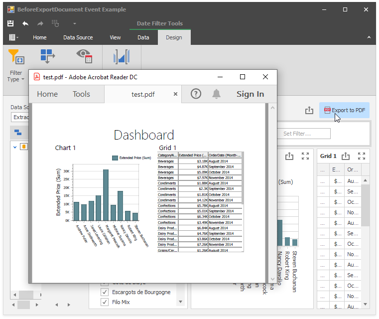

# How to Handle the BeforeExportDocument event to Hide Dashboard Filters

This example demonstrates how to hide dashboard filter items when a dashboard is exported to PDF and the [ExportFilters](https://docs.devexpress.com/Dashboard/DevExpress.DashboardCommon.DashboardPdfExportOptions.ExportFilters) is set to **false**.

This method can be the used to handle the following events:

* [DashboardDesigner.BeforeExportDocument](https://docs.devexpress.com/Dashboard/DevExpress.DashboardWin.DashboardDesigner.BeforeExportDocument)
* [DashboardViewer.BeforeExportDocument](https://docs.devexpress.com/Dashboard/DevExpress.DashboardWin.DashboardViewer.BeforeExportDocument)
* [ASPxDashboard.BeforeExportDocument](https://docs.devexpress.com/Dashboard/DevExpress.DashboardWeb.ASPxDashboard.BeforeExportDocument)
* [DashboardConfigurator.BeforeExportDocument](https://docs.devexpress.com/Dashboard/DevExpress.DashboardWeb.DashboardConfigurator.BeforeExportDocument)
* [DashboardControl.BeforeExportDocument](https://docs.devexpress.com/Dashboard/DevExpress.DashboardWpf.DashboardControl.BeforeExportDocument)

API in this example:

* [DashboardDesigner.BeforeExportDocument](https://docs.devexpress.com/Dashboard/DevExpress.DashboardWin.DashboardDesigner.BeforeExportDocument) event
* [BeforeExportDocumentEventArgs](https://docs.devexpress.com/Dashboard/DevExpress.DashboardCommon.BeforeExportDocumentEventArgs) class
* [DashboardDesigner.CustomizeDashboardTitle](https://docs.devexpress.com/Dashboard/DevExpress.DashboardWin.DashboardDesigner.CustomizeDashboardTitle) event
* [DashboardDesigner.ExportToPdf](https://docs.devexpress.com/Dashboard/DevExpress.DashboardWin.DashboardDesigner.ExportToPdf.overloads) method
* [DashboardDesigner.ConfigureDataConnection ](https://docs.devexpress.com/Dashboard/DevExpress.DashboardWin.DashboardDesigner.ConfigureDataConnection) event